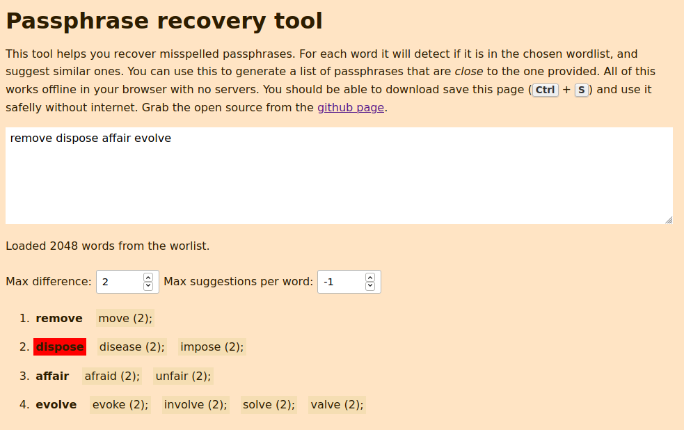

# [Passphrase recovery tool](https://tofran.github.io/passphrase-recovery-tool/)

Easily recover misspelled passphrases.

## Usage

  - Visit https://tofran.github.io/passphrase-recovery-tool/
    
    You should be able to save the live version hitting `Ctrl + S` and use it offline.

  - Download or clone from github and open `dist/index.html` with your browser.

## Build

  1. Make sure you have `node 12.x`;
  2. Clone this repo;
  3. `npm install`;
  4. `npm start` for development or `npm run build` to create a release bundle.

## License

GNU General Public License v3.0